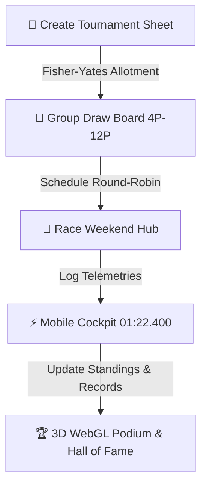

<div align="center">

  

  # 🏎️ MONOPOSTO ARENA
  ### *Open-Source Formula 1 Esports Championship & Telemetry Suite*

  [](https://champtracker-two.vercel.app)
  [](https://monoposto-tracker-backend.onrender.com/docs)
  [](https://nextjs.org)
  [](https://fastapi.tiangolo.com)
  [](https://developers.google.com/sheets/api)
  [](https://champtracker-two.vercel.app)

  ---

  *An open-source, mobile-first F1 tournament & race telemetry platform engineered for sim racing leagues, esports communities, and gaming friend groups.*

</div>

<br/>

## 🎯 Real-World Use Case

Managing F1 esports leagues or casual racing tournaments usually requires expensive custom database infrastructure or tedious manual spreadsheets. 

**MonoPosto Arena** solves this by providing a **100% open-source, serverless-friendly platform** that uses **Google Spreadsheets as the real-time database backend**:

1. **🏁 For Sim Racing & Esports Leagues**: Automatically generate randomized Fisher-Yates group allotments (4P, 6P, 8P, 10P, 12P), schedule round-robin duels, and calculate live championship standings.
2. **⚡ For Mobile Telemetry Logging**: Drivers or race stewards can record lap times on mobile using smart numeric auto-formatting (`0122400` ➔ `01:22.400`), live gap trackers, and single-tap copy shortcuts.
3. **⚔️ For Rivalry & H2H Comparison**: Settle track rivalries in the **H2H Battle Arena** with tug-of-war dominance meters, speed delta margins (`+0.420s`), and career win percentages.
4. **🏆 For Podium Celebrations**: Celebrate grand prix winners with a **3D WebGL Grand Prix Ceremony** featuring 3D Gold, Silver & Bronze trophies, physical champagne sprays, and gold spotlights.
5. **📊 Zero Database Maintenance**: Live data automatically syncs with your personal Google Sheets—meaning 100% free hosting, live spreadsheet editing, and built-in local JSON fallback if offline.

---

## 🌟 Core Application Features



### 🏆 3D WebGL Grand Prix Ceremony
- **3D Trophy Models**: Custom Three.js rendered Gold (P1), Silver (P2), and Bronze (P3) F1 cups with handles and crown tops.
- **Dynamic Physics FX**: WebGL champagne particle jets, falling metallic confetti, and illuminated step pedestals.

### ⚔️ Head-to-Head Battle Arena
- **Rivalry Face-Off**: Driver battle cards with team avatar rings.
- **Dominance Meter**: Interactive tug-of-war win percentage bar.
- **Speed Delta Metrics**: Calculates career win rates, average dominance margins (`+0.420s`), and total titles.

### ⚡ Ergonomic Telemetry Cockpit
- **Smart Time Formatting**: Auto-formats 7 raw numbers (`0122400` ➔ `01:22.400`) on mobile touch keypads.
- **Copy Shortcuts**: Pre-fill best lap input fields with a single tap.
- **Live Gap Bar**: Real-time delta gap visualization and predicted winner indicators.

### 👑 Circuit Records & Hall of Fame
- **Difficulty Filters**: Filter circuits by `Easy`, `Medium`, `Hard`, and `Extreme`.
- **King of the Circuit**: Crown badges for track record holders, undefeated streak banners, and unclaimed track alerts.

---

## 🛠️ Tech Stack & Architecture

| Component | Technology | Purpose |
| :--- | :--- | :--- |
| **Frontend UI** | Next.js 16 (Turbopack), React 19, Tailwind CSS | Mobile glassmorphic application UI & PWA support |
| **3D Rendering** | Three.js / React Three Fiber, Anime.js | WebGL 3D Grand Prix podium & smooth touch animations |
| **Backend API** | FastAPI (Python 3.11), Pydantic v2 | Clean Architecture REST API with Repository & Cache layers |
| **Database** | Google Sheets API (`gspread`) | Free, cloud-synced database editable directly in Google Drive |
| **Deployment** | Vercel (Frontend), Render (Backend) | 100% Free production hosting |
| **Keepalive** | GitHub Actions Workflow (`keepalive.yml`) | Automated pinger preventing 24/7 backend cold starts |

---

## 🚀 Quick Start Guide

### 1. Clone Repository
```bash
git clone https://github.com/GuruGouthamKanchi/champtracker.git
cd champtracker
```

### 2. Launch Backend (FastAPI)
```bash
cd backend
python -m venv venv

# On Windows:
venv\Scripts\activate
# On macOS/Linux:
source venv/bin/activate

pip install -r requirements.txt
python -m uvicorn app.main:app --reload --host 0.0.0.0 --port 8000
```
> REST API will run on `http://localhost:8000` (Docs at `http://localhost:8000/docs`).

### 3. Launch Frontend (Next.js)
```bash
cd ../frontend
npm install
npm run dev
```
> Mobile App will run on `http://localhost:3000`.

---

## 🌐 Live Production Deployment

- **📱 Live Application**: [https://champtracker-two.vercel.app](https://champtracker-two.vercel.app)
- **📖 OpenAPI Documentation**: [https://monoposto-tracker-backend.onrender.com/docs](https://monoposto-tracker-backend.onrender.com/docs)
- **📁 GitHub Repository**: [https://github.com/GuruGouthamKanchi/champtracker](https://github.com/GuruGouthamKanchi/champtracker)

---

<div align="center">

Open-Source Software built with ❤️ for F1 & Esports Lovers by **Guru Goutham Kanchi**

</div>
