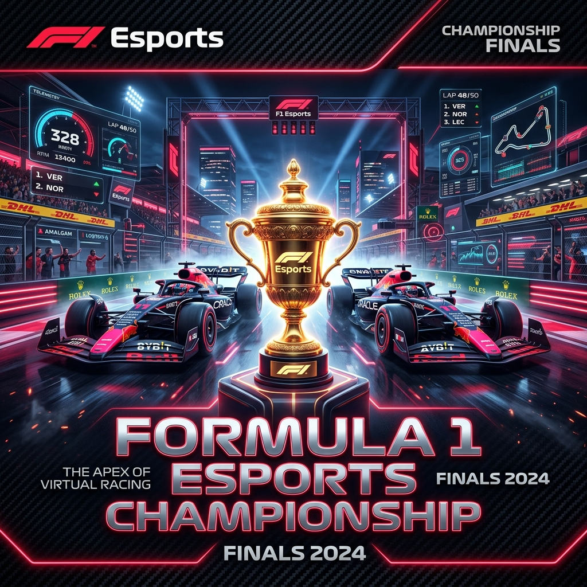
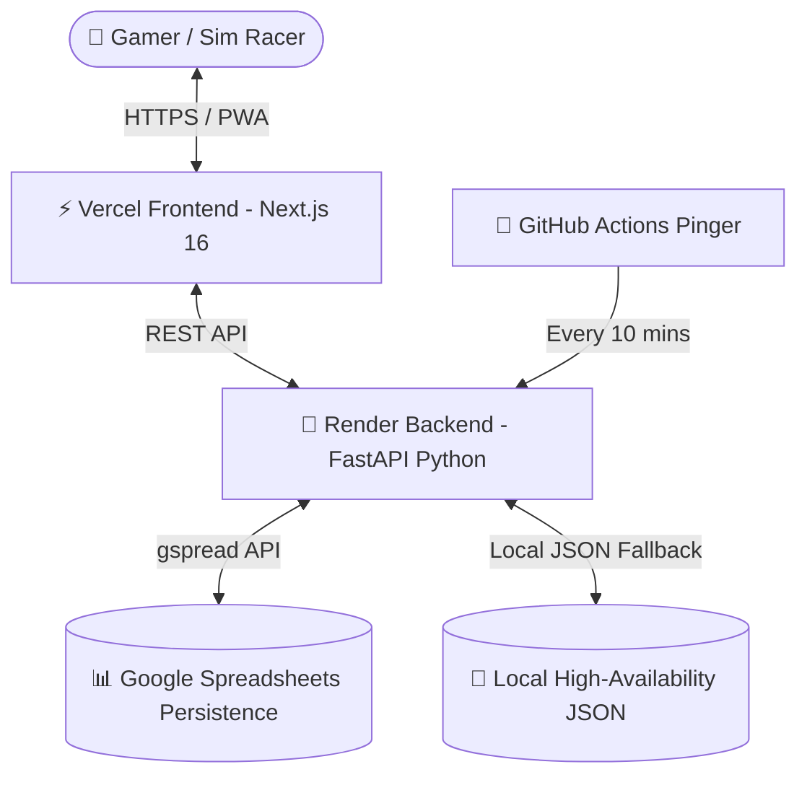

<div align="center">

  

  # 🏎️ MONOPOSTO ARENA
  ### *Ultimate F1 Esports Championship & Telemetry Suite*

  [](https://champtracker-two.vercel.app)
  [](https://monoposto-tracker-backend.onrender.com/docs)
  [](https://nextjs.org)
  [](https://fastapi.tiangolo.com)
  [](https://developers.google.com/sheets/api)
  [](https://champtracker-two.vercel.app)

  ---

  *A high-octane, mobile-first Formula 1 tournament management and race telemetry suite built for sim racers, esports leagues, and casual gamers.*

</div>

<br/>

## 🌟 Key Features

### 🏆 3D WebGL Grand Prix Podium
- **Interactive 3D Trophies**: Custom Three.js rendered Gold (P1), Silver (P2), and Bronze (P3) F1 cups with handles and crown tops.
- **Victory FX**: Dynamic WebGL champagne particle jets, falling metallic confetti physics, and glowing step pedestals with **1**, **2**, **3** rank badges.

### ⚔️ H2H Driver Battle Arena
- **Rivalry Face-Off**: Side-by-side driver battle cards featuring custom team avatar rings.
- **Tug-of-War Dominance Meter**: Real-time win percentage comparison bar.
- **Speed Delta Metrics**: Calculates career win rates, average dominance margins (`+0.420s`), and total championship titles.

### ⚡ Mobile Telemetry Cockpit
- **Smart Time Auto-Formatting**: Typing 7 raw digits (e.g. `0122400`) automatically formats to millisecond precision `01:22.400`.
- **Race-Time Copy Shortcuts**: Pre-fill best lap input fields with a single tap.
- **Live Gap Tracker**: Real-time delta gap visualization and winner prediction engine.

### 👑 Circuit Records & Hall of Fame
- **Track Difficulty Filters**: Categorizes circuits into `Easy`, `Medium`, `Hard`, and `Extreme` difficulties.
- **King of the Circuit**: Crown badges for track record holders, undefeated streak banners, and unclaimed circuit callouts.

### 🎲 Fisher-Yates Group Allotment
- **Capacity Presets**: Supports 4P, 6P, 8P, 10P, and 12P driver tournament groups.
- **Animated Reveal Board**: Fisher-Yates group draw reveal with staggered driver entry cards.

---

## 🛠️ Architecture & Tech Stack



| Layer | Technologies |
| :--- | :--- |
| **Frontend** | Next.js 16 (Turbopack), React 19, Three.js / React Three Fiber, Anime.js, Tailwind CSS, Lucide Icons |
| **Backend** | FastAPI (Python 3.11), Clean Repository & Cache Layer, Pydantic v2 |
| **Persistence** | Google Sheets API (`gspread`) + Local High-Availability JSON Fallback |
| **Deployment** | Vercel (Frontend), Render (Backend), GitHub Actions 24/7 Keepalive Pinger |

---

## 🚀 Quick Start Guide

### Prerequisites
- Node.js `v18+`
- Python `3.10+`

### 1. Clone Repository
```bash
git clone https://github.com/GuruGouthamKanchi/champtracker.git
cd champtracker
```

### 2. Start Backend (FastAPI)
```bash
cd backend
python -m venv venv
# On Windows:
venv\Scripts\activate
# On macOS/Linux:
source venv/bin/activate

pip install -r requirements.txt
python -m uvicorn app.main:app --reload --host 0.0.0.0 --port 8000
```
> Backend API will run on `http://localhost:8000` (Docs at `http://localhost:8000/docs`).

### 3. Start Frontend (Next.js)
```bash
cd ../frontend
npm install
npm run dev
```
> Mobile App will run on `http://localhost:3000`.

---

## 🌍 Live Production Deployment

- **📱 Live Application**: [https://champtracker-two.vercel.app](https://champtracker-two.vercel.app)
- **📖 API Documentation**: [https://monoposto-tracker-backend.onrender.com/docs](https://monoposto-tracker-backend.onrender.com/docs)

---

<div align="center">

Made with ❤️ for F1 & Esports Lovers by **Guru Goutham Kanchi**

</div>
